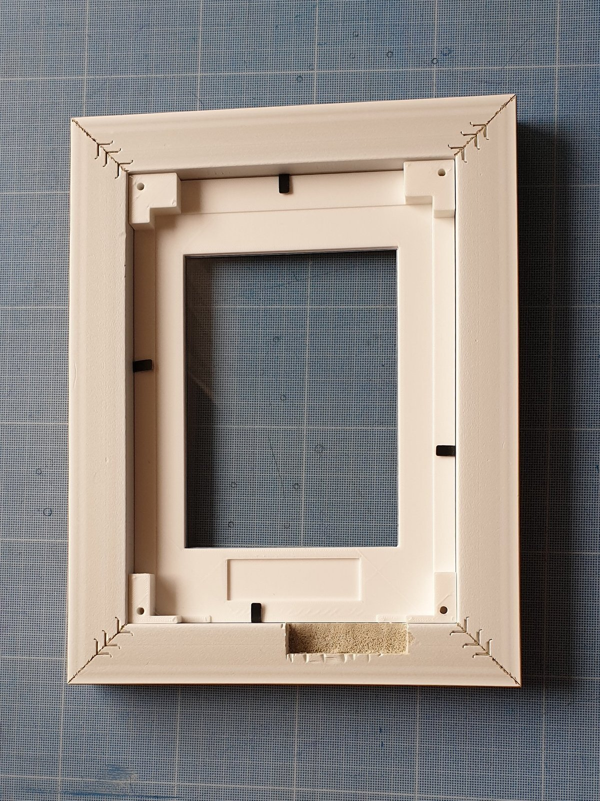
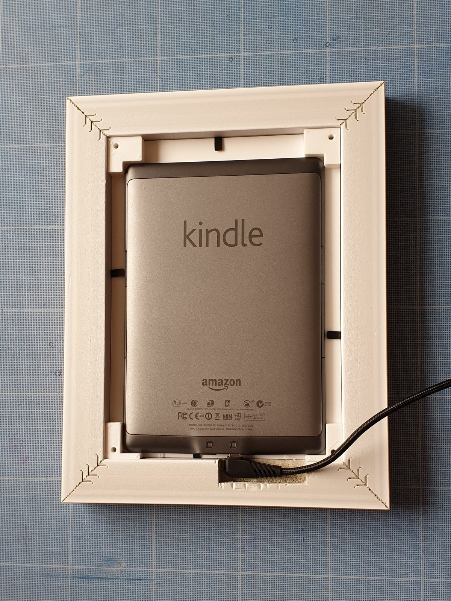
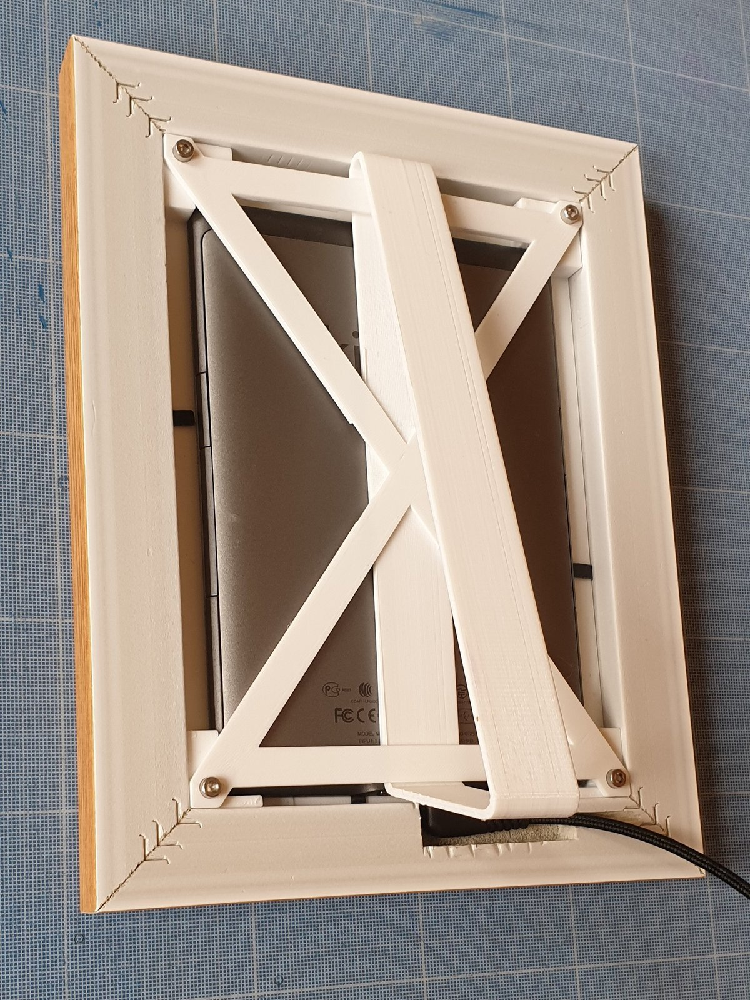
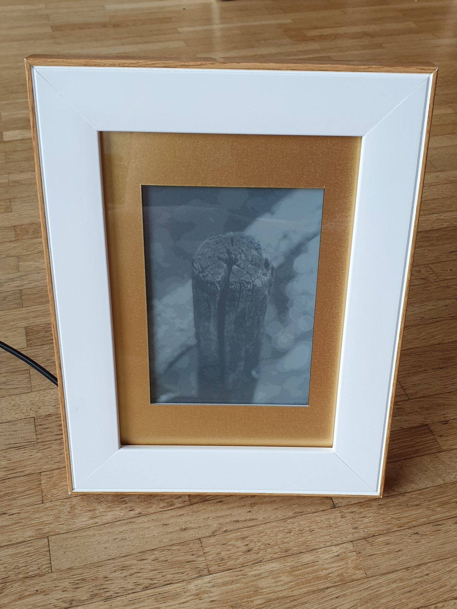

# Kindle frame

Adapter to upcycle an old Kindle4 into a photo frame.

## Enclosure

Done with openscad, could be adapted to different frame sizes. Kindle is centered in the frame.

## Images

Kindle resolution is 600*800 pixels, 4 bits per pixel. Not exactly photo friendly, but still a good way to bring back memories ! The `eips` tool used to display images on the e-ink screen requires an image with exact size, otherwise it will be cropped.

Pictures are resized and converted to grayscale PNG using imagemagick, using the `convert-images.sh` script.

## Kindle

The images are stored on the kindle, as it has plenty of space (1.2 GB) available. 

The `init.sh` script will be called whenever the Kindle reboots, disabling the UI and powersaving, to allow cron jobs to run.

The `display.sh` script will update the screen with a random image. A bit fun since only `sh` is available on the kindle, so I had to resort to `awk` to pick a random file. The `display.sh` script will be called 3 times per day to update the picture.

__Disclaimer : you can break your kindle. proceed at your own risk !!__

Preparing the kindle is a bit more involved.
1. [Jailbreak kindle](https://wiki.mobileread.com/wiki/Kindle4NTHacking#Jailbreak)
1. [Install kite](https://www.mobileread.com/forums/showthread.php?t=168270)

After having enabled ssh access, and intalled kite, the required scripts are copied onto the kindle using `deploy.sh`.

## Final result

The 3d printed frame

With the Kindle

With the back

Here you can see the artefacts of 4bpp conversion (on the top of the image).

## Thanks

- Original tutorial here : https://fnordig.de/2015/05/14/using-a-kindle-for-status-information/ 
- Picking a random file using awk : https://stackoverflow.com/a/35389210/971